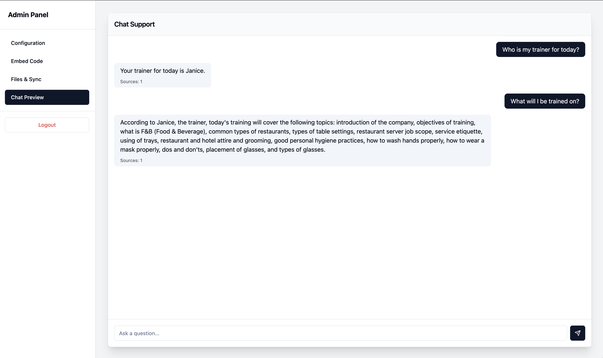
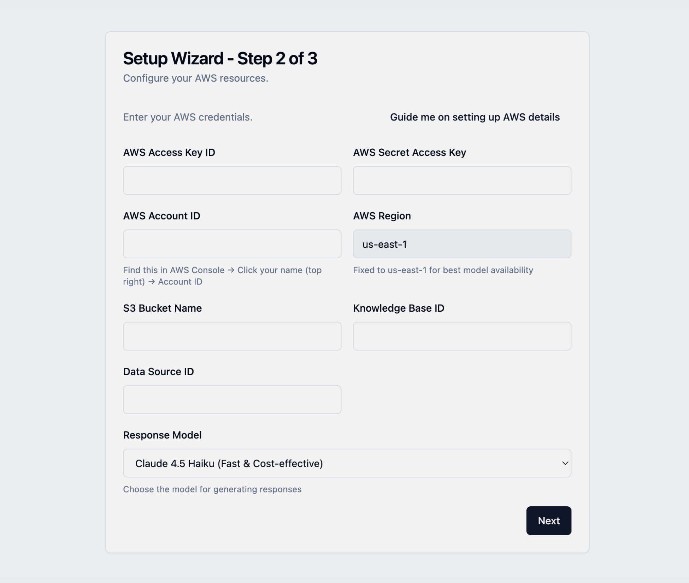
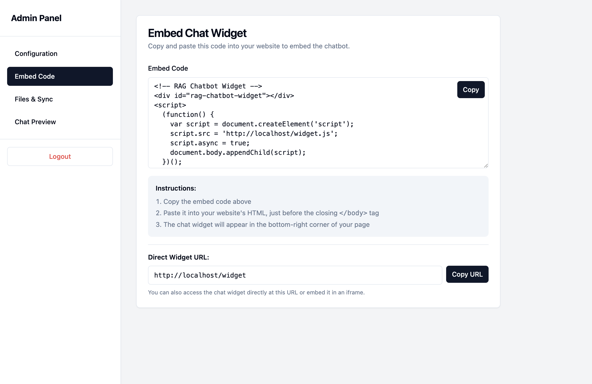
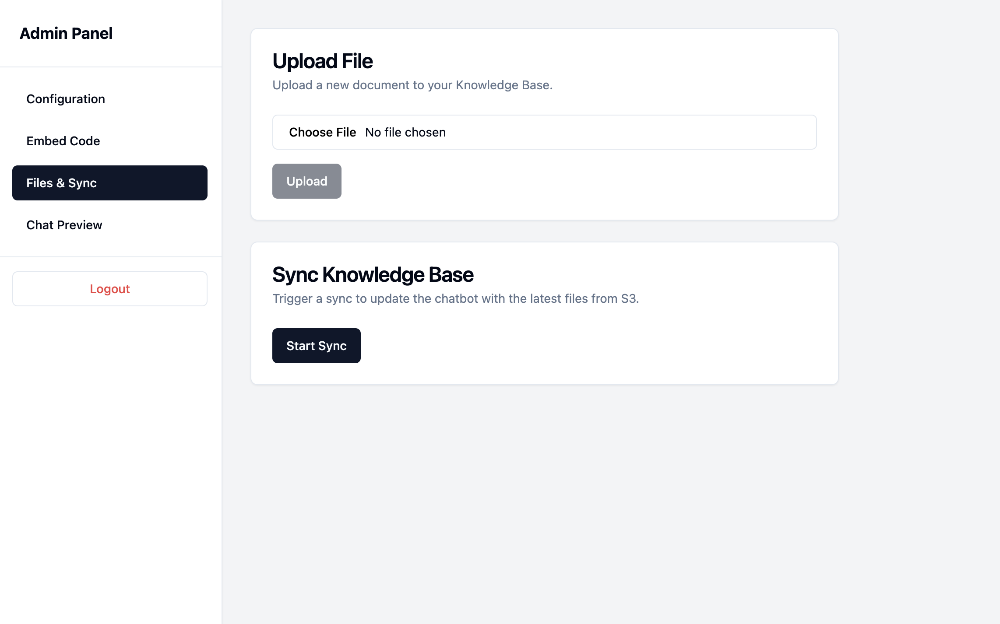

# AWS Bedrock RAG Chatbot



A drop-in app for your VPS/server, embeddable chatbot powered by AWS Bedrock with Retrieval-Augmented Generation (RAG) capabilities.

## Quick Start

### Prerequisites

- Docker and Docker Compose installed
- AWS Account with Bedrock access
- AWS credentials (Access Key ID and Secret Access Key)

### Installation

1. **Clone the repository**

```bash
git clone <your-repo-url>
cd aws-bedrock-rag-chatbot
```

2. **Run the setup script**

```bash
./setup.sh
```

The script will:

- Ask if you want to reset the database (interactive prompt)
- Build and start the application in production mode
- Display access URLs

3. **Complete the setup wizard**

- Visit `http://localhost/wizard`
- Create admin account
- Configure AWS credentials and model settings
- Upload your knowledge base documents

## ✨ Features at a Glance

<table>
  <tr>
    <td align="center">
      
      <br />
      <b>🚀 One-Click Setup Wizard</b>
      <br />
      <sub>Get started in minutes with our guided configuration flow</sub>
    </td>
    <td align="center">
      
      <br />
      <b>💬 Embeddable Chat Widget</b>
      <br />
      <sub>Copy embed code or use direct link for seamless integration on any website or mobile webview</sub>
    </td>
    <td align="center">
      
      <br />
      <b>🔄 Automatic Vector Store Sync</b>
      <br />
      <sub><strong>Upload files and automatically sync with AWS Bedrock Knowledge Base vector store</strong></sub>
    </td>
  </tr>
</table>

## Deployment Modes

### Production Mode (Default)

For production deployment on VPS/servers:

```bash
./setup.sh
```

**Features:**

- Optimized build with minified assets
- Generic error messages (security)
- Binds to `0.0.0.0` for external access
- Accessible via server IP address

**Access:**

- Local: `http://localhost`
- External: `http://YOUR_SERVER_IP`
- Backend API: `http://YOUR_SERVER_IP:8000`
- API Docs: `http://YOUR_SERVER_IP:8000/docs`

### Development Mode

For local development with hot reload:

```bash
./setup.sh --dev
```

**Features:**

- Frontend hot module replacement (instant updates)
- Backend auto-reload on code changes
- Detailed error messages with tracebacks
- Faster iteration cycle

## Setup Script Options

```bash
./setup.sh [--dev] [--clean|--no-clean]
```

**Options:**

- `--dev` - Run in development mode with hot reload
- `--clean` - Reset database and volumes before starting
- `--no-clean` - Keep existing database (skip interactive prompt)

**Examples:**

```bash
# Interactive setup (prompts for database reset)
./setup.sh

# Production with clean database
./setup.sh --clean

# Development mode with clean database
./setup.sh --dev --clean

# Production keeping existing data
./setup.sh --no-clean
```

## Environment Configuration

### API URL Configuration

The frontend automatically configures the API URL based on the environment:

**Development Mode:**

- Uses `http://localhost:8000` (defined in `docker-compose.dev.yml`)
- Allows local development with hot reload

**Production Mode:**

- Uses relative paths (empty `VITE_API_URL`)
- All API calls go through the same domain as the frontend
- Works seamlessly with nginx reverse proxy

If you need to customize the API URL, you can:

1. **For development:** Create a `.env.development` file in the `frontend/` directory:

```env
VITE_API_URL=http://localhost:8000
```

2. **For production:** Modify the build args in `docker-compose.yml`:

```yaml
rag-chatbot-frontend:
  build:
    context: ./frontend
    args:
      VITE_API_URL: "" # Empty for relative paths, or specify full URL
```

### Port Configuration

By default, the application uses:

- **Frontend:** Port 8080 (mapped from container's port 80)
- **Backend:** Port 8000
- **Nginx Reverse Proxy:** Port 80 (public-facing)

To change ports, edit `docker-compose.yml`:

```yaml
ports:
  - "YOUR_PORT:80" # Frontend
  - "YOUR_PORT:8000" # Backend
```

## VPS/Server Deployment

### Deployment Steps

1. **Clone the repository on your VPS:**

```bash
git clone <your-repo-url>
cd aws-bedrock-rag-chatbot
```

2. **Run the setup script:**

```bash
./setup.sh
```

3. **Configure Nginx (see below)**

4. **Restart services:**

```bash
docker-compose down
docker-compose up -d --build
sudo systemctl restart nginx
```

### Firewall Configuration

If using Nginx reverse proxy (recommended):

```bash
# HTTP
sudo ufw allow 80/tcp

# HTTPS
sudo ufw allow 443/tcp

# SSH (if not already enabled)
sudo ufw allow 22/tcp

# Enable firewall
sudo ufw enable
```

**Note:** Ports 8000 and 8080 should NOT be exposed externally when using nginx reverse proxy. They will be accessible only to nginx on localhost.

### Recommended: Use Nginx Reverse Proxy

For production, use Nginx to:

- Serve on port 80/443
- Handle SSL/TLS certificates
- Proxy backend API requests
- Load balancing and connection management

**Important**: The Docker frontend container runs on port 8080, backend on port 8000.

Example Nginx configuration (`/etc/nginx/nginx.conf`):

```nginx
user www-data;
worker_processes auto;
pid /run/nginx.pid;

events {
    worker_connections 4096;
    multi_accept on;
    use epoll;
}

http {
    sendfile on;
    tcp_nopush on;
    tcp_nodelay on;
    keepalive_timeout 65;
    types_hash_max_size 2048;

    # Buffer Settings (prevents header/cookie size errors)
    client_header_buffer_size 16k;
    large_client_header_buffers 4 32k;
    client_max_body_size 50M;
    client_body_buffer_size 128k;

    # Proxy Settings
    proxy_buffering on;
    proxy_buffer_size 16k;
    proxy_buffers 8 16k;
    proxy_busy_buffers_size 32k;
    proxy_connect_timeout 60s;
    proxy_send_timeout 60s;
    proxy_read_timeout 60s;

    include /etc/nginx/mime.types;
    default_type application/octet-stream;

    access_log /var/log/nginx/access.log;
    error_log /var/log/nginx/error.log;

    gzip on;
    gzip_vary on;
    gzip_proxied any;
    gzip_comp_level 6;
    gzip_types text/plain text/css text/xml text/javascript
               application/json application/javascript application/xml+rss;

    server {
        listen 80;
        server_name your-domain.com;

        # API routes
        location /api/ {
            proxy_pass http://127.0.0.1:8000/;
            proxy_http_version 1.1;

            proxy_set_header Host $host;
            proxy_set_header X-Real-IP $remote_addr;
            proxy_set_header X-Forwarded-For $proxy_add_x_forwarded_for;
            proxy_set_header X-Forwarded-Proto $scheme;
            proxy_set_header Connection "";
        }

        location /auth/ {
            proxy_pass http://127.0.0.1:8000/auth/;
            proxy_http_version 1.1;

            proxy_set_header Host $host;
            proxy_set_header X-Real-IP $remote_addr;
            proxy_set_header X-Forwarded-For $proxy_add_x_forwarded_for;
            proxy_set_header X-Forwarded-Proto $scheme;
            proxy_set_header Connection "";
        }

        location ~ ^/admin/(config|upload|sync|reset)$ {
            proxy_pass http://127.0.0.1:8000$request_uri;
            proxy_http_version 1.1;

            proxy_set_header Host $host;
            proxy_set_header X-Real-IP $remote_addr;
            proxy_set_header X-Forwarded-For $proxy_add_x_forwarded_for;
            proxy_set_header X-Forwarded-Proto $scheme;
            proxy_set_header Connection "";
        }

        location /chat/ {
            proxy_pass http://127.0.0.1:8000/chat/;
            proxy_http_version 1.1;

            proxy_set_header Host $host;
            proxy_set_header X-Real-IP $remote_addr;
            proxy_set_header X-Forwarded-For $proxy_add_x_forwarded_for;
            proxy_set_header X-Forwarded-Proto $scheme;
            proxy_set_header Connection "";
        }

        # Frontend - proxy to Docker container on port 8080
        location / {
            proxy_pass http://127.0.0.1:8080;
            proxy_http_version 1.1;

            proxy_set_header Host $host;
            proxy_set_header X-Real-IP $remote_addr;
            proxy_set_header X-Forwarded-For $proxy_add_x_forwarded_for;
            proxy_set_header X-Forwarded-Proto $scheme;
            proxy_set_header Upgrade $http_upgrade;
            proxy_set_header Connection "upgrade";
        }
    }
}
```

#### System Limits

Ensure your system can handle the connections:

```bash
# Edit /etc/security/limits.conf
* soft nofile 65536
* hard nofile 65536
nginx soft nofile 65536
nginx hard nofile 65536
```

Then restart nginx:

```bash
sudo nginx -t
sudo systemctl restart nginx
```

## Features

- **One-Click Setup Wizard**: Easy first-time setup flow with guided AWS configuration
- **Embeddable Chat Widget**: Copy embed code or use direct link to add the chatbot to any website or mobile webview
- **🔄 Automatic Vector Store Sync**: **Upload files and automatically sync with AWS Bedrock Knowledge Base vector store** - no manual configuration needed
- **Admin Dashboard**: Configure AWS credentials, manage files, and monitor the chatbot
- **AWS Bedrock Integration**: Powered by Claude models (Haiku 4.5, Sonnet 4, Sonnet 4.5)
- **Model Selection**: Choose between different Claude models based on your needs
- **Production Error Handling**: Generic error messages in production, detailed in development

## Architecture

- **Frontend**: React + TypeScript + Vite + shadcn/ui + Tailwind CSS (Node 22)
- **Backend**: Python 3.11 + FastAPI + SQLAlchemy + Boto3
- **Database**: SQLite (persistent via Docker volume)
- **Deployment**: Docker + Docker Compose

## Configuration

### AWS Requirements

1. **AWS Bedrock Access**: Enable Claude models in your AWS account
2. **Knowledge Base**: Create a Bedrock Knowledge Base
3. **S3 Bucket**: For document storage
4. **IAM Permissions**: Ensure your AWS credentials have access to:
   - Bedrock Runtime
   - Bedrock Knowledge Bases
   - S3

### Model Selection

Available models (configured in Admin Dashboard):

- **Claude 4.5 Haiku**: Fast & cost-effective (default)
- **Claude 4 Sonnet**: Balanced performance
- **Claude 4.5 Sonnet**: Most capable

## URLs

- **Frontend**: `http://localhost` (or `http://YOUR_SERVER_IP`)
- **Backend API**: `http://localhost:8000`
- **API Documentation**: `http://localhost:8000/docs`
- **Chat Widget**: `http://localhost/widget`
- **Admin Dashboard**: `http://localhost/admin`

## Troubleshooting

### Database Issues

Reset the database:

```bash
./setup.sh --clean
```

### Port Conflicts

If ports 80 or 8000 are in use, modify `docker-compose.yml`:

```yaml
ports:
  - "8080:80" # Change frontend port
  - "8001:8000" # Change backend port
```

### View Logs

```bash
# All services
docker compose logs -f

# Backend only
docker logs aws-bedrock-rag-chatbot-rag-chatbot-backend-1 -f

# Frontend only
docker logs aws-bedrock-rag-chatbot-rag-chatbot-frontend-1 -f
```

### Nginx Issues

**"worker_connections are not enough"**

- Increase `worker_connections` in nginx.conf (see Nginx configuration section above)
- Default is 768, recommended: 4096+

**"Request Header Or Cookie Too Large"**

- Increase buffer sizes in nginx.conf:

```nginx
client_header_buffer_size 16k;
large_client_header_buffers 4 32k;
```

**"Connection refused" or 502 Bad Gateway**

- Verify Docker containers are running: `docker ps`
- Check if ports are accessible: `curl http://localhost:8080` and `curl http://localhost:8000`
- Verify nginx configuration: `sudo nginx -t`
- Check nginx error logs: `sudo tail -f /var/log/nginx/error.log`

**Frontend making calls to localhost:8000 instead of production domain**

- Ensure you've rebuilt the frontend after the latest changes:

```bash
docker-compose down
docker-compose up -d --build
```

## Security Notes

- Change the `SECRET_KEY` in `docker-compose.yml` for production
- Use HTTPS with SSL certificates (via reverse proxy)
- Restrict AWS IAM permissions to minimum required
- Keep AWS credentials secure and never commit them to version control

## Future Feature Checklist

### Very Soon

- **Interrogation style chatbot**
- **Customize chatbot colour palette**
- **Request metadata support** - Able to put request metadata on the widget and embed so it can greet the user by its name and some other details needed (useful for mobile apps)

### Plan

- **Region flexibility and dynamic model availability** - Based on available on-demand inference at AWS at selected region
